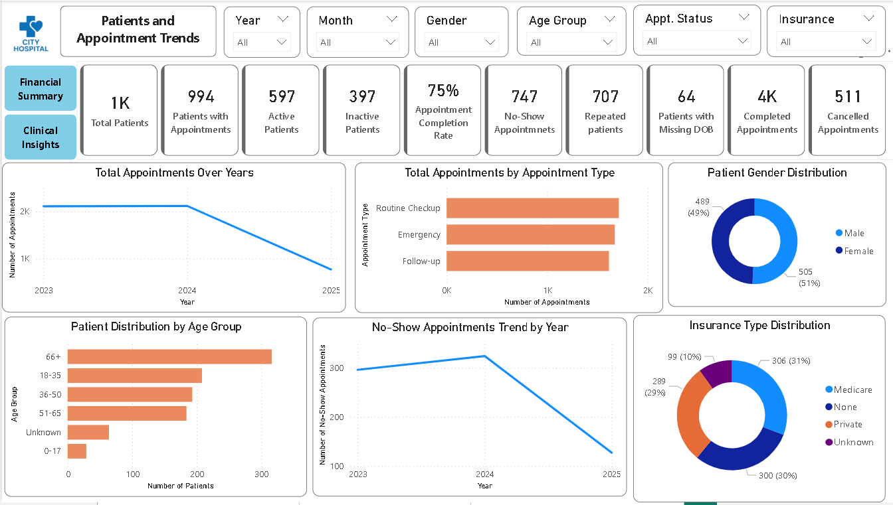
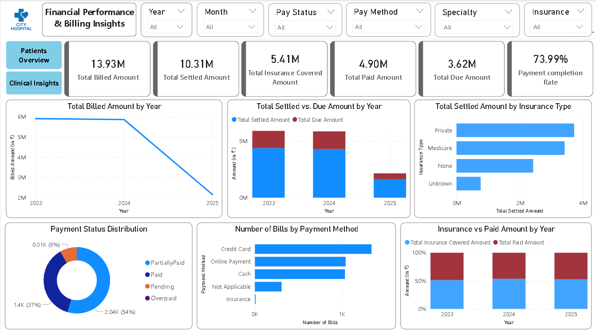
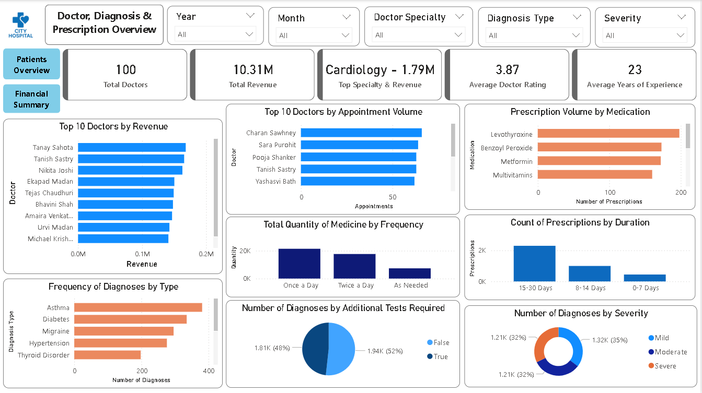

# End-to-End Healthcare Analytics with SQL & Power BI


This project demonstrates a complete end-to-end healthcare analytics solution — from synthetic data generation to interactive dashboards — integrating **Python**, **SQL**, and **Power BI** to extract actionable insights from hospital operations, clinical care, and financial data.

---

## 🔍 Project Overview

City Hospital faces challenges in patient engagement, appointment management, billing efficiency, and chronic disease monitoring. This project builds a framework to analyze hospital operations, financial performance, doctor activity, and clinical outcomes.

**Highlights:**  
- Synthetic dataset generated using Python (**Faker**) simulating patients, doctors, appointments, diagnoses, prescriptions, and billing.  
- SQL-based cleaning and transformation ensure consistency, relational integrity, and actionable metrics.  
- Power BI dashboards provide interactive visualization for operational, financial, and clinical insights.
  
**Note:** All financial values are in Indian Rupees (₹) and shown in millions (M).

For detailed documentation, refer to [Project Documentation (PDF)](./document/Project_Documentation.pdf).

---

## 📊 Power BI Dashboards

### 1. Patient & Appointment Trends  
Monitor patient activity, appointment types, completion rates, and demographics.  



### 2. Financial Performance & Billing  
Track billed vs settled amounts, insurance contributions, payment status, and collection gaps. 



### 3. Doctor, Diagnosis & Prescription Overview  
Analyze doctor performance, revenue, common diagnoses, and prescription patterns.  



---

## 📌 Overall Insights & Recommendations

**Key Observations:**  
- **Operational Gaps:** High no-show rates (~15%) and inactive patients (~40%) reduce efficiency.  
- **Financial Leakages:** ₹3.62M unpaid dues (~26%) and low insurance coverage.  
- **Chronic Disease Burden:** Asthma, Diabetes, Hypertension, and Migraine dominate patient load.  
- **Doctor Performance Misalignment:** Appointment volume does not directly correlate with revenue.

**Strategic Recommendations:**  
- **Patient Engagement:** Digital reminders, re-engagement campaigns, and wellness initiatives.  
- **Financial Optimization:** Strengthen collections, expand insurance coverage, and promote cashless/digital payments.  
- **Chronic Care Programs:** Long-term disease management plans, regular follow-ups, preventive care packages.  
- **Resource & Performance Management:** Align doctor workload with revenue goals and optimize diagnostic test utilization.

---

## 🚀 Tools & Technologies

- **Python (Faker, Pandas):** Synthetic data generation  
- **SQL (MySQL):** Data cleaning and transformation  
- **Power BI:** Interactive dashboards and visualization  

---

## 📁 Repository Structure
```
📦 End-to-End Healthcare Analytics with SQL & Power BI
├── data/                 # Synthetic data CSVs
├── sql_queries/          # SQL scripts for cleaning and analysis
├── powerbi_dashboard/    # Power BI dashboard file (.pbix)
├── images/               # Dashboard screenshots
├── document/             # Project documentation (PDF)
├── python_code/          # Python dataset generation scripts
└── README.md             # Project overview
```

---

## 📌 Key Outcomes

- End-to-end synthetic healthcare dataset with relational integrity.  
- SQL-based data cleaning and feature engineering for reliable analysis.  
- Three interactive dashboards highlighting operational, financial, and clinical insights.  
- Actionable recommendations to improve hospital efficiency, revenue, and patient care.  


